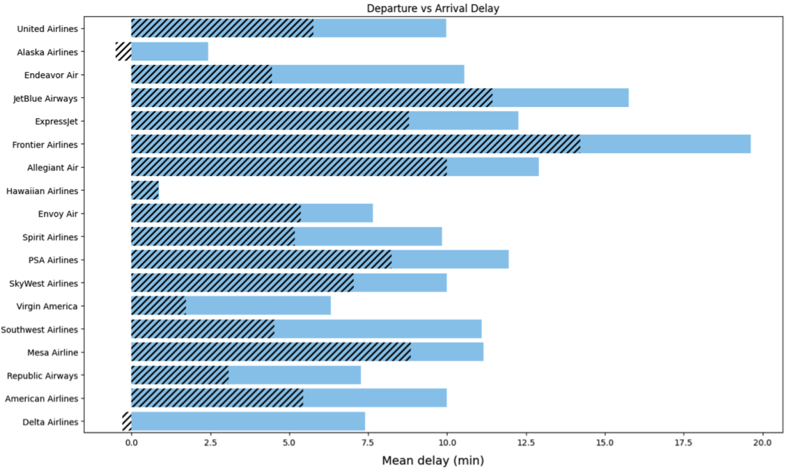
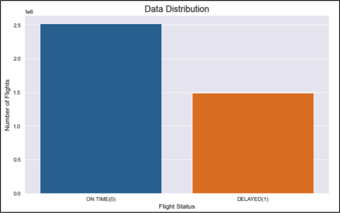
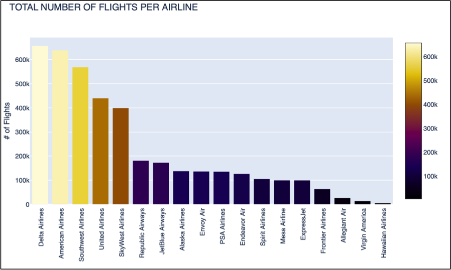
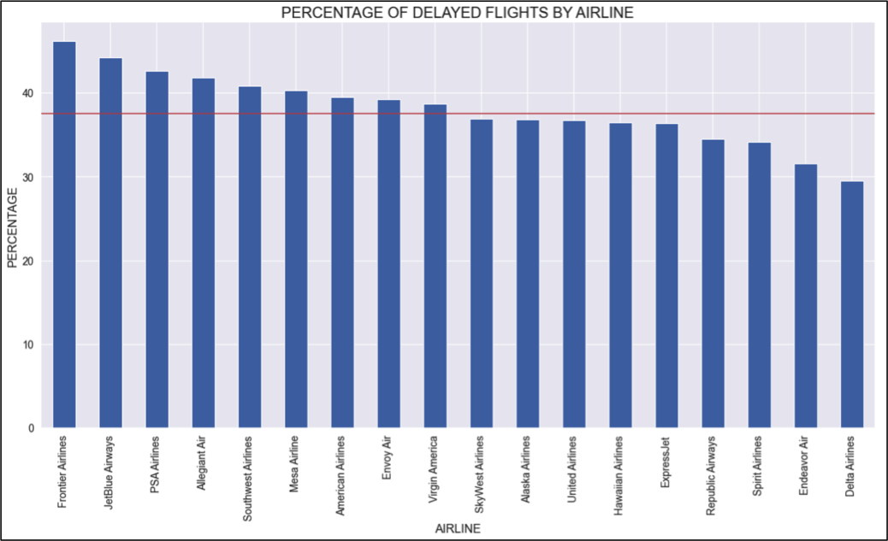
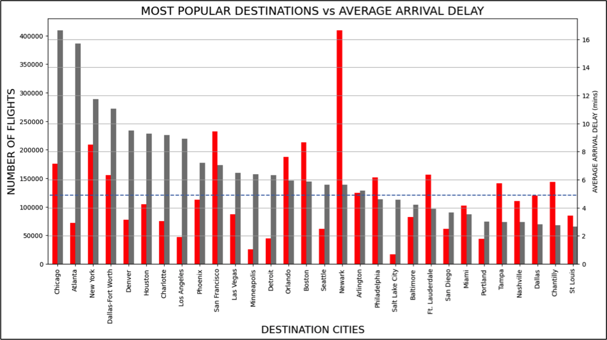
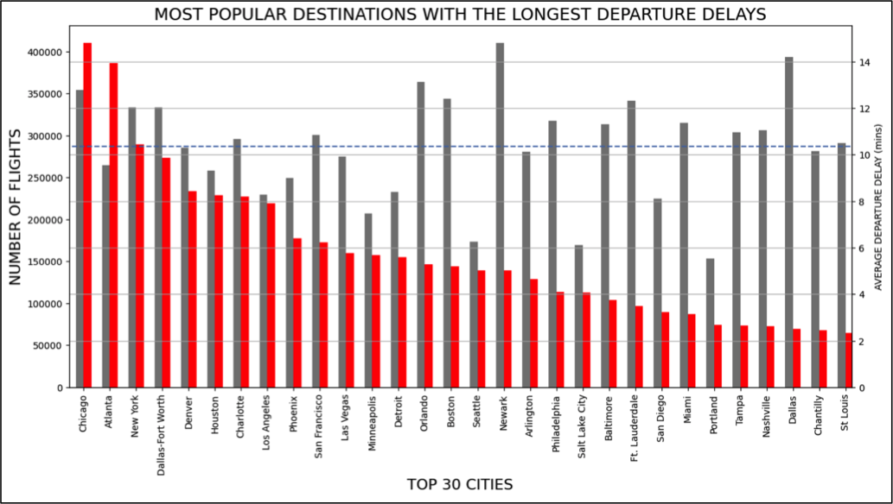
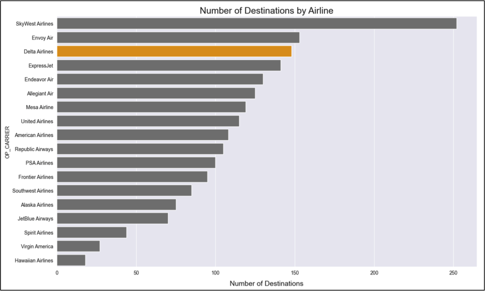
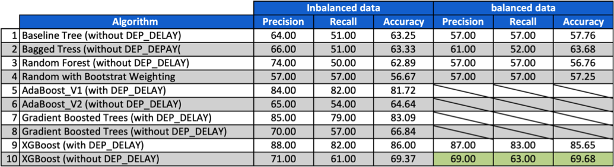
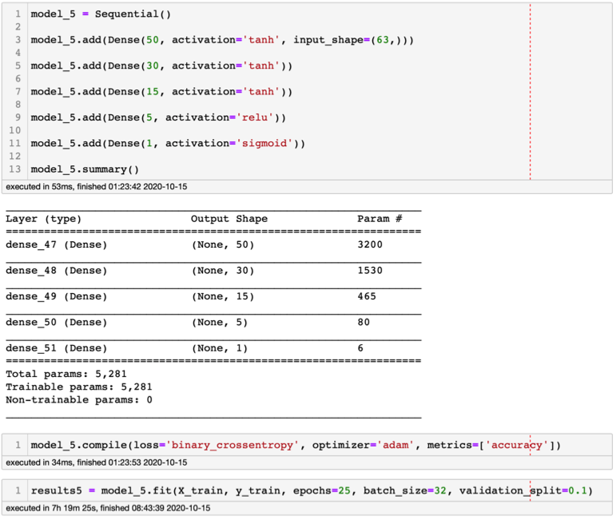
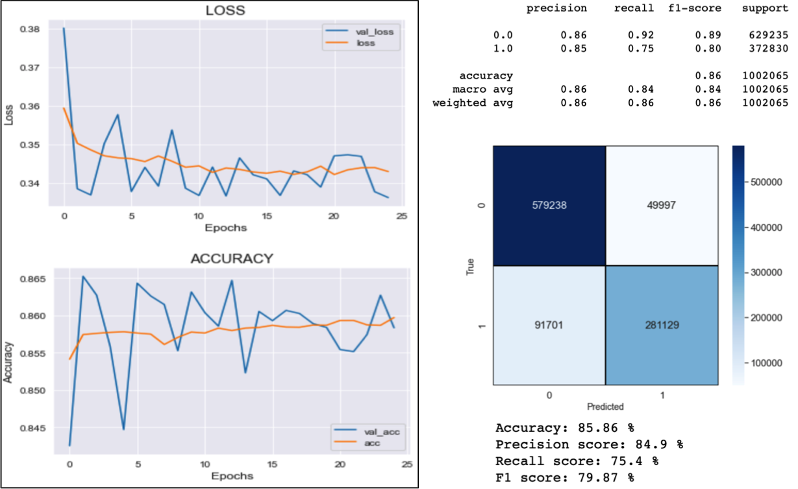

# <font size="8"><b>PREDICTING FLIGHT DELAYS</b></font>

# Introduction

Flight delay has become a very important subject for air transportation all over the world because of the associated financial loses that the aviation industry is continuously going through. 

According to data from the Bureau of Transportation Statistics (BTS) of the United Stated, over 20% of US flights were delayed during 2018, which resulted in a severe economic impact equivalent to circa 41 billion US$.

These delays not only cause inconvenience to the airlines, but also to passengers. With the increased travel time comes and increase in expenses associated to food and lodging and this results in added stress among passengers, but this doesn't account for the growing distrust towards the airlines, who also suffer from extra costs such as those associated to their crews, aircraft repositioning, increased fuel consumption while trying to reduce their elapse time, and many others that tarnish the airlines reputation and often result in the loss of demand by passengers. 

The reasons for these delays vary a lot going from air congestion to weather conditions, mechanical problems, difficulties while boarding passengers, and simply the airlines inability to handle the demand given its capacity.

So what can be done as a passenger to avoid delayed flights? is it possible to know if your flight will be delayed before it comes up on the departure boards? or before you being inside the plane? The answer to these questions is maybe. By using Machine Learning (ML) Algorithms you can try to predict if your flight will be delayed in many ways. Of course, all of these different algorithms will have pitfalls and a certain degree of accuracy, and they will all depend on the data that they are fed.

In this project I will look at different ML algorithms including MLP Neural Networks to try to predict if a flight will be delayed or not before it is even announced on the departure boards. So I will not be aiming to get the highest accuracy possible, because if I wanted to do that, it would be quite easy by adding a series of features/categories that will biased the model in terms of predictive power. Examples of these are "departure delays" and "arrival delays". Think about it. If you go into a plane knowing already that there is a departure delay, chances are that your flight will be late at arrival. The same happens if you already know that the plane has an arrival delay. So this information will be looked at as part of the Exploratory Data Analysis (EDA), but will be taking out of the models with detailed explanations as why. Furthermore, I will run an algorithm with all of these features that biased the models to prove how easy it would be to get a high accuracy, but in reality not too useful because you will be already sitting on the plane. 

# Objective

The objective of this project is very clear as described in the introduction: <b>"Design a Model that predicts flight delays before they are announced on the departure boards"</b>

# Data Gathering

The dataset comes from <a href="https://www.kaggle.com/yuanyuwendymu/airline-delay-and-cancellation-data-2009-2018">Kaggle</a>, and it consists of a multi-year data ranging from 2009 to 2018 separated in 10 different files.

Each one of these datasets has 28 categories/features in average with a few million rows. Because of the size of each file I chose to work with only one, corresponding to the 2018. This one consists of 28 categories with just over 7.2 million rows.

Below is the glossary of all the features/categories available

<b><u>Glossary</u></b>

<b>FL_DATE</b> = Date of the Flight<br>
<b>OP_CARRIER</b> = Airline Identifier<br>
<b>OP_CARRIER_FL_NUM</b> = Flight Number<br>
<b>ORIGIN</b> = Starting Airport Code<br>
<b>DEST</b> = Destination Airport Code<br>
<b>CRS_DEP_TIME</b> = Planned Departure Time<br>
<b>DEP_TIME</b> = Actual Departure Time<br>
<b>DEP_DELAY</b> = Total Delay on Departure in minutes<br>
<b>TAXI_OUT</b> = The time duration elapsed between departure from the origin airport gate and wheels off<br>
<b>WHEELS_OFF</b> = The time point that the aircraft's wheels leave the ground<br>
<b>WHEELS_ON</b> = The time point that the aircraft'ss wheels touch on the ground<br>
<b>TAXI_IN</b> = The time duration elapsed between wheels-on and gate arrival at the destination airport<br>
<b>CRS_ARR_TIME</b> = Planned arrival time<br>
<b>ARR_TIME</b> = Actual Arrival Time = ARRIVAL_TIME - SCHEDULED_ARRIVAL<br>
<b>ARR_DELAY</b> = Total Delay on Arrival in minutes<br>
<b>CANCELLED</b> = Flight Cancelled (1 = cancelled)<br>
<b>CANCELLATION_CODE</b> = Reason for Cancellation of flight: A - Airline/Carrier; B - Weather; C - National Air System; D - Security<br>
<b>DIVERTED</b> = Aircraft landed on different airport that the one scheduled<br>
<b>CRS_ELAPSED_TIME</b> = Planned amount of time needed for the flight trip<br>
<b>ACTUAL_ELAPSED_TIME</b> = AIR_TIME+TAXI_IN+TAXI_OUT<br>
<b>AIR_TIME</b> = The time duration between wheels_off and wheels_on time<br>
<b>DISTANCE</b> = Distance between two airports<br>
<b>CARRIER_DELAY</b> = Delay caused by the airline in minutes<br>
<b>WEATHER_DELAY</b> = Delay caused by weather<br>
<b>NAS_DELAY</b> = Delay caused by air system<br>
<b>SECURITY_DELAY</b> = caused by security reasons<br>
<b>LATE_AIRCRAFT_DELAY</b> = Delay caused by security<br>

Source: <a href="https://www.kaggle.com/yuanyuwendymu/airline-delay-and-cancellation-data-2009-2018/version/1?select=2009.csv">Kaggle</a>

As I mentioned in the Introduction, I will be only considering features that you are aware of before the plane takes off. This way what I am predicting is before you board the plane and not while you are in the plane in mid air, which wouldn't be of much use as you would want to know if you will be late before you board the plane. Adding any of the features listed below would increase your accuracy to at least 85%, which sounds great, but then again, what's the point if you are already in the air or about to take off?<br>

* TAXI_OUT
* WHEELS_OFF
* WHEELS_ON
* TAXI_IN
* ARR_DELAY
* ACTUAL_ELAPSED_TIME

Now, there is an additional feature that will biased the models, and that is the DEP_DELAY (Departure Delay), which yes, if your plane is leaving late then your chances of arriving late to your destination will increase. The plot on Figure_1, which is part of the EDA done, shows this. There I compared the DEP_DELAY with the ARR_DELAY by airline, and as you can see, normally when your flight leaves late, the airlines pushes for the flights to have shorter elapse times to compensate for the delay, and in some cases, this is accounted for and the flight ends up arriving either on time, or earlier, such as with Delta Airlines and Alaska airlines, which have both negative arrival averages, meaning an early arrival. 



Figure_1. "Departure Delays" compared to "Arrival Delays" by airline

Some people might argue, that if your flight's departure is delayed, you will see it on the screens before you board the plane, so that means that I should leave it on my predictive model, right? well yes and no. Yes I should leave it because you are right about seeing the flight's departure being delayed before you board the plane, but then no, because a late departure will most probably mean a late arrival (Figure 1) even when the airline tries to compensate by reducing the elapsed time as the above plot suggests. So this will definitely affect the accuracy of my predictions in a positive but unrealistic predictive way. Still, I have ran two models for each ML and Neural Network algorithm that I have tested, one with the DEP_DELAY and a second without the DEP_DELAY. You will notice that there is a large difference in the accuracy of the models and respective metric, but that is because of the nature of the predictions being made. 

# Data Preprocessing/Cleaning

The data preprocessing and cleaning was done in two separate parts, documented in two notebooks to make it easier to follow up due to their length. 

The first section is a standard cleaning involving minimal feature engineering, and the second is driven after the 20 most common arrival destinations were defined based on the number of flights and is the one that contains the most feature engineering done.

The first step before going into the data cleaning was to define what I will be considering a <b>delayed flight</b>. This is important because it will determine if I can drop or not any other columns and how I will be choosing the predictive features to work with. So, for a flight to be considered delayed, it has to meet the following criteria: 

<b>* Arrive late at its destination</b><br>

Quite simple, and this means, that even if a flight has a delay from its departure, but still arrives to its destination on time, it will not be considered a delayed flight</b>

Based on the above, also a canceled flight will not be a delayed one either. Therefore, you can assume that I dropped that column, but not only for this reason, but also due to the high number/percentage of missing values (~81%). This could have been very useful for EDA, but unfortunately most of it was not available. 

Each one of the columns within the main dataframe was analyzed individually with the exception of the following 5:<br>

1. CARRIER_DELAY<br>
2. WEATHER_DELAY<br>
3. NAS_DELAY<br>
4. SECURITY_DELAY<br>
5. LATE_AIRCRAFT_DELAY<br>

These 5 represent the different reasons why a flight is delayed. Unfortunately, for the 2018 dataset, 5,744,152 rows are missing, adding an 81% of the entire dataset. Therefore, a decision to drop those columns was also made.

Another set of features that were interesting but were not taken into account for the predictive modeling were the following four:

1. TAXI_OUT
2. WHEELS_OFF
3. WHEELS_ON
4. TAXI_IN


These four, as Figure_2 illustrates, add up the elapse time, which is the amount of time initially planned for the flight. Unfortunately, these don't add much value plus they can biased the model, so as a result they were dropped. An interesting fact about these columns though, is that a significant number of WHEELS_ON and TAXI_IN didn't have any values, whereas their respective TAXI_OUT and WHEELS_OFF did. How should this be interpreted? is it because the airlines responsible for them made mistakes and forgot about them? or is it because these aren't that relevant for them? more on this can be seen on the Cleaning and Preprocessing notebook where I tried to explain my findings and relate them to the responsible/owner airlines, but for the time being these will enter the category of what are known as ghost flights. 

Because there are quite a few features on this dataset, I won't explain the work done on each one of them, instead I will just mentioned some that I found interesting, and if you would like to see more detail, the two cleaning and processing notebooks have every step explained in depth. 

After a brief look at the data, the key features that needed some immediate work were the Airline (OP_CARRIER), and departing (ORIGIN) and arrival city/airport (DEST). These needed to have their abbreviations and their IATA codes changed to the airline and airports names respectively.  

The dataset for this particular year (2018) didn't have available the airport.csv file with their name and IATA codes, and because this dataset contains 358 airports, adding them manually was not an option given the time for this project. The airlines was the easy part as they were only 18 of them, so that was done with the help of Wikipedia. For the IATA codes, the solution was to use the older file from 2015 by using its list of airports, then compared it to the one from the 2018 that I extracted from my main dataset (.csv file). That gave a difference of 41 airports that needed to be found online plus 4 airports that were on the 2015 list but not on the 2018 list, therefore those needed to be dropped. This still involved a bit of manual work but considerably less than the initial 358. 

In terms of engineered features, the first one to be calculated was the target (FLIGHT_STATUS) which was the flight being delayed or not. This is a binary column, with a 0 for flights arriving on time, and a 1 for flights arriving late, calculated from the "Arrival Delay" (ARR_DELAY) column. With this column ready, the next step was a quick check for the data distribution, meaning, checking if the data is balanced or not. Results are plotted on Figure 3 and they suggest a severe imbalance dataset with an almost 2:1 ratio, this means right away that looking at accuracy on its own will not be enough to evaluate the models, but I will also need to look at other metrics such as Precision, Recall and F1.



Figure 3. Data distribution showing a high imbalance dataset. 

The imbalanced data means that I will need to weight these two classes while training my models. 

Other features were engineered mainly to perform the EDA. Among those, some of the most relevant were: 

* Calculating the total number of flights and total numbers of delayed flights (from departure and arrivals separately) by airline<br>
* Extracting the "weekday" from the date using the "datetime" function from Pandas. Using the same function, the "month" and "day of the month" were also extracted<br>
* Calculating percentages of delayed departures and arrivals by airlines and by cities<br>
* Extracting the top destinations with average delays and arrivals<br>
* Calculating best weekday to travel in terms of delays (departures and arrivals)<br>
* Impact of late departure on arrival time (with difference between both)<br>


As with the cleaning and preprocessing, if you wish to see more detail about the feature engineering, refer to the respective notebooks.


# Exploratory Data Analysis (EDA)

The same way how the data cleaning and preprocessing was done in two separate notebooks, the EDA was done in two as well, however the difference here is that the visualizations done on each of the EDAs were done with different libraries. The first was done using matplotlib and Seaborn, and the second with plotly.

On the first EDA notebook, the following questions were addressed:

1. Total Number of Flights by Airline<br>
2. Number of Delayed Flights by Airline<br>
3. Percentage of Delayed Flights by Airline<br>
4. Total Minutes Delayed by Airline<br>
5. Average Delay Time by Airline<br>
6. 30 Most Common Destination (Cities)<br>
7. Worse and Best months to travel <br>
8. Is there a Better day of the month to travel?<br>
9. Best weekday to avoid delays<br>
10. Impact of Delays (Departure vs Arrival Delay)<br>
11. Most Popular Destinations with Average Arrival Delays <br>
12. Number of Destination by Airline<br>
13. Recommended airlines based on lowest delay times<br>

You will notice that each one of these questions were addressed and discussed individually and afterward, put together to answer question 13. 

Again, I won't go through all of them here, but just share a few interesting findings:

<b>Total Number of Flights by Airline:</b> The plot from Figure 3 talks by itself, therefore, it is quite easy to interpret. Basically stating that the top 5 airlines in terms of number of flights are:

* SouthWest Airlines<br>
* Delta Airlines<br>
* American Airlines<br>
* SkyWest Airlines<br>
* United Airlines<br>

With no additional comments about this, I will come back to this list after looking at other plots.




Figure 3. Total number of flights by airline sorted is descending order. 

<b> Percentage of Delayed Flights by Airline:</b> It seems normal to think that the most flights you have the more likely it is that you will end up having more delayed flights. It's simple math right? For example, lets assume a fix percentage of delayed flights such as 30%, well 30% of 100 is 30, whereas 30% of 1000 is 300. We translate that into flights, and there is a huge difference with a ratio of 10:1 in terms of numbers, but the percentage remains the same. 

Now according to this dataset, the average of delayed flights in the US for 2018 was 37.52%, which is the red horizontal line on plot from Figure 4. I know that in the introduction I mentioned a 20% of flights within the US being delayed, but that number if overall for the 58 airlines that operate domestic US flights, whereas my dataset only looks at 18 airlines which I am assuming are the major carriers.

You as the airline don't want to be above that red line/threshold, you want to be as far as possible below it. If you pay attention to Delta Airline, they are top 5 in terms of number of flights, but they are dead last in terms of delay percentage. It is quite interesting the relationship that they have managed to achieve.

Another interesting observation is that SouthWest Airlines and American Airlines are two of the other top 5 in terms of number of flights and they are both above that threshold that we want to avoid. 




Figure 4. Percentage of delayed flights by airline


<b>Most Popular Destinations with the largest arrival delay:</b> Because there are a total of 358 destination airports within 341 cities, I decided to focus only on the top 30. 

Chicago, Atlanta, New York, Dallas-Fort Worth and Denver are the top 5 destination, with Chicago being number 1, but interesting enough it has a pretty high average of annual delays, so if you are traveling to Chicago, there is a high chance that your flight will be delayed. Atlanta in the contrary, is the second most popular destination and with a very low delay at arrivals. New York and Dallas-Fort Worth aren't great, and Denver is just within the  average. 

Out of the top 15 destinations, the city with the most delays is by far Newark, where you are almost guaranteed to arrive late. Others cities that have very negative records are San Francisco, Orlando, Boston, Philadelphia, Ft. Lauderdale, Tampa and Chantilly. 



Figure 5. Most popular destinations (cities) with their average arrival delay (min)

Now the plot on Figure 5 compares the most popular destinations again with the average departure delays, with the dashed line being the average. So again, you would want to be below that threshold, but in this case we are talking about cities and multiple airlines at the same time. 

If we look at Chicago, we can see that it has quite a high average departure delay, but combining this information with the one from Figure 4, we can infer that flights going to Chicago try to compensate for late departures by reducing the elapse time, and in average it seems as they succeed. With regards to Atlanta, it still is in a good position by being the second most popular destination, with low arrival delay and still with an average delay below the average. I am not sure if this is related to the arrival or departure airports, the weather in this area, or why exactly this happens, and in order to explain it, I would need some additional data which I don't have and that goes beyond the scope of this project anyways, but perhaps is something that can be added later on. 

Once again Newark is in bad shape by having the highest average of departures delayed. Orlando and Boston and two others that combined with Figure 4, puts them in bad position. And then you can see the cities which are in pretty bad shape going way above the threshold, such as Philadelphia, Baltimore, Ft. Lauderdale, Miami, Tampa, Nashville and Dallas. Reasons for this? again not enough data nor time to find out. 



Figure 6. Most popular destinations (cities) with longest average departure delays (min)


<b>Number of destinations by Airlines</b> The plot from Figure 7 is the last one that I will comment on this introductory README. Here you see the number of destinations per airline and once again it's interesting because it shows as highlighted on that plot, that Delta Airlines is the third with most destination. Remember, that it is also top 5 in terms of number of flights, it has the lowest percentage of delayed flights, and it is in negative with regards to the total delayed minutes. It seems as they perform quite well from this pack of 18 airlines so it is the one that I would recommend based on this information for the year 2018. Now this might have changed, I really could say. What I could do and add it later on to this project, is extend the study to all the files cover the 10 years available and that way see if this is a one year trend, or if it is really a historical one, which in that case, it will become more solid to make such a recommendation, but for now I will have to live with what I have.



Figure 7. Number of destinations by airline

# Modeling

Now that the data has been cleaned and gone through a thorough EDA process done in two stages, its time to start with the modeling which will be a binary classification, where a "0" will correspond to a flight being on time, and a "1" to a flight being delayed. 

This dataset consists of 28 features, out of which there are a series of them (listed above) that can affect the predictive model in a positive way in terms of predictions and therefore accuracy. However, when you use them, you are making the assumption that you are most probably already sitting in the plane, or in the best case scenario, your flight status on the departure boards has been changed to: "delayed". This is what the majority of the published models do, so I decided to do something slightly different by limiting the model to only features that won't directly indicate a delay. 

Because I am not sure which Machine Learning algorithm will be the best for this type of binary classification I will be testing the following six:

1. Bagged Trees<br> 
2. Random Forest<br>
3. AdaBoost<br>
4. Gradient Boosted Trees<br>
5. XGBoost<br>
6. Deep Neural Network (MLP)

Through this notebook you will read that I am referring to ML and Neural Networks, now I know that strictly speaking a Neural Network is a type of ML model that is usually a supervised learning, so I am doing this only for practicality reasons due to the way how I will be using and evaluating both.

We already know that this dataset if severely imbalanced which will force me to do weighting with most of the ML algorithms. Putting that aside, the next step was to check for "categoricals", which I knew I had plenty such as the air carriers, days, months, weekdays, departure and arrival cities, and every column related with time and/or dates. So quite a few to deal with. At this point the decision to drop several columns was made to simplify the dataset, and the ones kept were dealt with using hot_encoding, you can follow all the details on the Cleaning and Preprocessing notebooks. So now let's separate the models into ML and Deep Neural Network models and go through what was done with each:

## Machine Learning

For the ML the workflow was pretty straight forward by starting defining the target, which was the FLIGHT_STATUS, and then dropping it alongside the DEP_DELAY from the dataframe to define X (features). With this done, I split the data with a 25 and 75% for the test and training set respectively and used a typical random_State of 42.

This was followed by the next steps:

* Building a Regular Tree as Baseline<br>
* Created Bagged Trees<br>
* Ran a Random Forest with no Class Weighting (ran the feature importance as a QC tool)<br>
* Random Forest with Bootstrat Class Weighting<br>
* Ran a AdaBoost with and without the DEP_DELAY<br>
* RAN Gradient Boosted Trees with and without the DEP_DLAY<br>
* RAN XGBoost with and without the DEP_DELAY<br>

And every model went through a performance evaluation, with the highest accuracy achieved wasn't great at 70% when the DEP_DELAY (departure delay) was dropped, without dropping the DEP_DELAY the highest accuracy obtained was 86, so a hard 16% better with only one feature that suggest a late arrival. Now you can get the picture of how much the accuracy can improve if I add the rest of these predictive features, certainly it will increase above the 90%.

Figure 8 is a summary of the model evaluations done with and without balancing the data, and with and without the DEP_DELAY feature. Colored in green, is the XGBoost that outperform the other models, and without using any of the features that could biased the model towards a predicted delay.



Figuree 8. Model Evaluation Summary

The classification report for what I chose to be my best model until this point can be seen on Figure 9 and as you can see the metrics aren't the best but at lest this is predicting the flight delay before you are even on your way to the airport by a good 70% 


Figure 9. XGBoost Classification report of the model with the best performance so far. 

## Deep Neural Networks

At this point I jumped to MLP Neural Networks, but before I start running models, it is important to be sure that my dataset fulfills the following three conditions:

* Data has to be purely numerical<br>
* Data cannot contain missing values<br>
* Data has to be Normalised<br>

The first two conditions were taken care of during the data pre-processing and cleaning, and the third at the beginning of every modeling notebook by using the StandardScaler.

Doing the MLP Deep Neural Network was more difficult and time consuming due to the high number of tests needed and the size of the dataset, which was reduced from +7 million to +4 million rows by limiting the study to the top 20 destination cities. At the end, close to 50 different model architectures were tested and are documented in their respective notebooks with the best one being the one from Figure 10. This figure contains a model summary, the compiler characteristics, and the fitting which was only done for 25 epochs. Unfortunately so far, my computer hasn't been able to run the 50 epochs which is one of my goals to try to reach convergence as there are some indications that it might happen with a higher number of epochs as the accuracy and loss plot from Figure 12 suggests.




               Figure 10. MLP Deep Neural Networks Model_5 internal architecture. 
    
    
Figure 11 is a summary of the Deep Neural Networks tests done. These were divided into 4 different notebooks, however you can only see three of them on that table as the forth was merely for fast testing and it contains 21 models so quite a larger spread sheet. Notice that there is a row highlighted in green from each Notebook pack, which corresponds to what I have interpreted as the best model for that particular Notebook. 

If you go inside the notebooks you will see that the features used vary a bit. I used the feature selection to help classify which one were causing background noise to the algorithm and therefore could be dropped, and that's how all the MONTHs were dropped. With that done the accuracy and other metrics increased with an average of 15%. 


                   Figure 11. Deep Neural Networks summary table


Below, Figure 12 is the model performance evaluation summary for Model_5 of the second set of models. This was chosen as the best model as seen on the metrics. 



Figure 12. Model 5 performance summary

This README and repository overall will be updated in the coming weeks with more test results plus a more complete and deeper EDA_2 by adding some new ideas into it using plotly. 

# Summary & Recommendations

* From the EDA done it seems as DA (Delta Airlines) and Alaska Airlines are two of the most reliable airlines in terms of arrivals on time, and in the case of DA, they are top 5 in number of flights per year, average delay (with the lowest), and number of destinations within the US. However it is important to remember that these conclusions are based on a 1 year data analysis and this could well be a good year for those airlines and bad for others for any particular reason, therefore I would recommend to follow this up by doing a more historical analysis adding the rest of the 9 years of data at least for the EDA, as I can imagine it would be a lot more hardware demanding to run the same models.<br> 

* It is quite hard to create a ML model for flight delay prediction before you even know that the flight is delayed on the departure board. Neural Networks responded a lot better under these conditions with an average difference in accuracy, precision and recall of over 15%. Maybe an even more thorough feature analysis could rise these metrics to close to 90%, so it might be worth investing the time to do so.<br>

* There are a series of variables (features) that were not included on this project due to a shortage of data and I believe after my research that they are key to predicting a flight delay accurately. Some of these are the weather, mechanical issues, and security issues. Then inside some of these there are sub-categories that also play a key role such as humidity, wind, precipitation, etc, and should be accounted for. All of this data is available but needs to be scraped from different websites and it will require quite a lot more work to add it to the existing dataset, but will certainly translate into more realistic and therefore more accurate predictions.  

# Way Forward

* Add to the EDA a time of the day analysis, to understand if there is a time more prone to delays than others. Because there are 24 hours a day, maybe make this every 3 hours, ending up with 8 categories. It is known that early and late in the day flights tend to have less delays, so this would be interesting to try to validate<br>


* Do the EDA with the 10 year dataset and not just the 2018. This will require additional cleaning and pre-processing but will definitely give more insight as to the airline performance and hence put me in a position to give a more accurate recommendation<br>


* Re-run the ML and Neural Network model with the best metrics again but with more cities with the objective of adding them into a dash application.<br>


* Keep on increasing the number of epochs on the Neural Networks to see if the model actually converges or not<br>


* Run the models again with all departures but only one destination, maybe Chicago and/or Atlanta and compare the outputs to the real ones to see how accurate the chosen model really is. 

# Notebook breakdown

The following is a breakdown of the Notebooks that are available on this repository with a short explanation of what each one contains:

* <b>Data_Cleaning_Preprocessing_I:</b> First part of the cleaning process with basic feature engineering<br>
* <b>Data_Cleaning_Preprocessing_II:</b> Second part of the cleaning with slightly more complex feature engineering done<br>
* <b>EDA_1:</b> This notebook consists of the first stage of Exploration Data Analysis done using matplotlib and Seaborn. In here you will find a series of questions that are answered based on visualization for which there is a lot of data engineering done<br>
* <b>EDA_2</b>: This is the second of the EDA documents which is different in that the plots have been done using the Plotly library. It is important to know that this notebook is relatively smaller compared to EDA_1, however the plan is to keep on adding more plots after this project is handed out (see way forward) <br>
* <b>RandomForest_Imbalanced:</b> Detailed Random Forest notebook with the dataset imbalanced. Categoricals were delt with here and a new .cdsv file was saved which will be later used on otheer models. In here a baseline tree was created for comparison purposes, then a Random Forest with no Classs Weighting, and finally a Random Forest with Bootstrat Class Weighting<br>
* <b>RandomForest_Balanced:</b> Similar to the previous notebook but since the beginning the data is balanced.<br>
* <b>RandomForest_AllFeatures:</b> Random Forest tests ran with all the features inclusing the DEP_DELAY to make a more faire comparison with other published models. Still this model only has that predictive variable which it is known to add predictive power, but no other. If more are added the accuraccy will keep on increasing<br>
* <b>AdaBoost_V1:</b> AdaBoost ran with all features including the DEP_DELAY.<br>
* <b>AdaBoost_V2:</b> AdaBoost ran without the DEP_DELAY<br>
* <b>XGBoost_V1:</b> XGBoost ran with the DEP_DELAY<br>
* <b>XGBoost_V2:</b> XGBoost ran without the DEP_DELAY<br>
* <b>MLP_NN_Part_I:</b> There are 7 different model architectures tested on this notebook with all of them having dropped the FLIGHT_STATUS and the DEP_DELAY<br>
* <b>MLP_NN_Part_II:</b> This notebook contains 7 Models as well, however the first one was trained with the DEP_DELAYS as a preditive feature and the other 6 have it dropped alongside with the MONTHS, this way there won't be anything that could biased the model.<br>
* <b>MLP_NN_Part_III:</b> this notebook has only 4 models which were trained initially with only the FLIGHT_STATUS and the DEP_DEELAY dropped, but also with those two plus all of the months, which were causing significant noise. <br>
* <b>MLP_NN_Part_IV:</b> This notebook has a total of 21 models architectures tested over a low number of epochs, with the highest being 10. It shows some mistakes that caused under and over fitting. All the models only have accuracy calculated for them. It was left here as part of the sandbox so that the reader can use it as a guide to avoid some of the same mistakes <br>


```python

```
